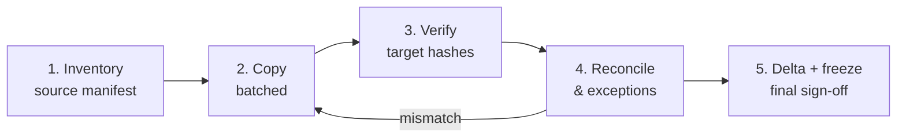

# Notification Archive Migration — Requirements & Solution Design

Version 1.0

## Context & objective

Migrate ~7 years of HTML notification files from Windows Server A to Windows Server B with zero data loss, proven by 100% SHA-256 reconciliation.

- **Volume:** terabytes (exact size and file count to be confirmed)
- **Previous attempt:** manual, took ~2.5 months, failed with many manual errors
- **This time:** automated, repeatable, auditable pipeline with controls at every stage
- **Primary goal:** governance and control — every file copied, byte-identical, with evidence for audit

## Scope & assumptions

In scope: all files and folders under the agreed source root(s) for the 7-year period, copied (never moved) to the target.

- **Method:** copy, never move — source stays the golden record until sign-off
- **Metadata preserved:** content, timestamps (created/modified), attributes, NTFS ACLs, folder structure
- **Source frozen:** read-only during final delta and cutover
- **Out of scope:** changing file content, re-rendering HTML, application-level changes to the notification system

**Open questions**

- [ ] Exact source and target paths (UNC shares or local drives)?
- [ ] Total size and file count?
- [ ] Is the source still receiving new notifications during migration?
- [ ] Network link speed between servers; same domain?
- [ ] Retention period for the source after sign-off?
- [ ] Do HTML files reference external assets (images, CSS) stored elsewhere?

## Functional requirements

The pipeline runs in five stages; each stage must pass its gate before the next starts.



Failed or mismatched files loop back to copy, then re-verify.

| ID | Requirement |
| --- | --- |
| FR-01 | Scan source; write a manifest row per file: relative path, size, created/modified time, attributes, ACL hash, SHA-256 |
| FR-02 | Split work into batches (by year/month folder) with a batch ID |
| FR-03 | Copy each batch with Robocopy (`/COPY:DATS /DCOPY:T /R:3 /W:5 /MT /LOG`), never `/MOV` or `/MIR` against the source |
| FR-04 | Scan target; compute SHA-256 and metadata per file into a target manifest |
| FR-05 | Reconcile source vs target manifests: missing, extra, size mismatch, hash mismatch, metadata mismatch |
| FR-06 | Auto-retry failed files up to N times; unresolved items go to an exception register |
| FR-07 | Resume safely after interruption (idempotent; skip already-verified files) |
| FR-08 | Delta run: detect files added/changed on source since the manifest; copy and verify them |
| FR-09 | Produce per-batch and final reconciliation reports (CSV + HTML summary) |
| FR-10 | Dry-run mode that inventories and plans without copying |

## Controls & governance matrix

Every control produces evidence that is retained with the migration record.

| ID | Control | Type | Evidence |
| --- | --- | --- | --- |
| C-01 | Source manifest with SHA-256 captured before any copy | Preventive | Signed manifest CSV + its own SHA-256 |
| C-02 | Copy only; source never modified or deleted | Preventive | Tool config review; source ACL set read-only at freeze |
| C-03 | 100% SHA-256 match source vs target | Detective | Reconciliation report, zero hash mismatches |
| C-04 | File count, total bytes, folder count per batch | Detective | Batch reconciliation totals |
| C-05 | Timestamp, attribute and ACL comparison | Detective | Metadata mismatch report |
| C-06 | Exception register with owner and resolution | Corrective | Register closed with zero open items |
| C-07 | Immutable, timestamped logs of every run | Audit | Log files + log checksums |
| C-08 | Maker-checker: operator runs, separate reviewer approves each gate | Governance | Gate approval records |
| C-09 | Final sign-off by source owner, target owner, control owner | Governance | Sign-off record |
| C-10 | Source retained for agreed period before decommission | Recovery | Retention ticket |

## HTML-specific checks

SHA-256 proves byte-identical content, so encoding (UTF-8/UTF-16, BOM) and line endings are covered automatically; these checks cover what hashing cannot.

- **Long paths:** flag paths over 260 characters; enable long-path support on both servers
- **File names:** flag special or Unicode characters, trailing spaces/dots, case-only duplicates
- **Linked assets:** parse `src`/`href` in each file; confirm relative images and CSS exist on target
- **Absolute links:** report any links hard-coded to the old server name (UNC or hostname) — do not rewrite, only report
- **Render sample:** open a random sample per batch (e.g. 0.1%) and confirm it renders
- **Zero-byte and malformed files:** report counts on source and target; they must match

## Non-functional requirements

| Area | Requirement |
| --- | --- |
| Performance | Parallel hashing and copy; throughput configurable so business hours are not impacted |
| Resilience | Checkpoint per batch; resume after crash or reboot without re-copying verified files |
| Scale | Manifest held in SQLite (not memory) to handle millions of files |
| Security | Runs under a dedicated service account with least privilege; no credentials in code or logs |
| Auditability | Logs append-only, UTC timestamps, each log file checksummed |
| Platform | PowerShell 7 + Robocopy on Windows Server; no third-party install unless approved |
| Observability | Progress per batch: files, bytes, ETA, errors |

## Solution design

A PowerShell 7 module that wraps Robocopy for the copy and does all inventory, hashing and reconciliation itself, driven by one config file.

**Modules**

| Module | Responsibility |
| --- | --- |
| `Config` | Load and validate `migration.config.json` |
| `Inventory` | Walk a root, collect metadata + SHA-256 in parallel, write to manifest DB |
| `Batching` | Build batches by year/month folder; assign batch IDs |
| `Copy` | Invoke Robocopy per batch; parse exit codes and logs |
| `Verify` | Inventory the target side for a batch |
| `Reconcile` | Compare source vs target; classify mismatches; write exception register |
| `HtmlChecks` | Long paths, names, asset links, absolute links, zero-byte files |
| `Report` | CSV + HTML reports per batch and final |
| `Audit` | Append-only structured log (JSON lines) with checksums |

**Config (example keys)**

```json
{
  "sourceRoot": "\\\\ServerA\\Notifications",
  "targetRoot": "\\\\ServerB\\Notifications",
  "batchBy": "yearMonth",
  "hashAlgorithm": "SHA256",
  "threads": 16,
  "maxRetries": 3,
  "renderSampleRate": 0.001,
  "dbPath": "D:\\Migration\\manifest.db",
  "reportDir": "D:\\Migration\\reports",
  "logDir": "D:\\Migration\\logs"
}
```

**Manifest table (`files`)**

| Column | Notes |
| --- | --- |
| `rel_path` | Path relative to root; key |
| `batch_id` | From Batching |
| `side` | `source` or `target` |
| `size_bytes`, `created_utc`, `modified_utc`, `attributes` | Metadata |
| `acl_hash` | SHA-256 of the SDDL string |
| `sha256` | Content hash |
| `status` | `pending`, `copied`, `verified`, `mismatch`, `exception` |
| `attempts`, `last_error` | Retry tracking |

**CLI**

```powershell
Migrate-Notifications -Stage Inventory  -Config .\migration.config.json
Migrate-Notifications -Stage Copy       -Batch 2019-03
Migrate-Notifications -Stage Verify     -Batch 2019-03
Migrate-Notifications -Stage Reconcile  -Batch 2019-03
Migrate-Notifications -Stage Delta
Migrate-Notifications -Stage Report     -Final
Migrate-Notifications -Stage All        -DryRun
```

## Acceptance criteria & test plan

The migration is accepted only when every source file has a verified, hash-identical copy on target and the exception register is empty.

**Acceptance criteria**

- [ ] Source file count = target file count, per batch and overall
- [ ] Source total bytes = target total bytes
- [ ] 100% SHA-256 match; zero missing, zero extra
- [ ] Timestamps, attributes and ACLs match (or approved exceptions)
- [ ] HTML checks run; all findings reviewed
- [ ] Exception register closed
- [ ] Final report and logs archived with checksums

**Test plan (before production)**

| Test | What it proves |
| --- | --- |
| Unit tests (Pester) for each module | Logic correct |
| Synthetic dataset with long paths, Unicode names, zero-byte files, deep nesting | Edge cases handled |
| Fault injection: corrupt a target file, delete one, add an extra | Reconcile catches every case |
| Kill mid-copy, then resume | Idempotent restart |
| Pilot on one year of real data | Throughput and full-run estimate |

## Runbook & sign-off

Run oldest year first as the pilot, then batches in order; each gate needs reviewer approval.

1. Dry run: inventory source, produce plan and size estimate
2. Pilot: one year end to end; review report; approve
3. Bulk: remaining batches, Copy → Verify → Reconcile per batch
4. Freeze: set source read-only; run Delta; reconcile
5. Final report; three-party sign-off
6. Cutover: point the notification application at Server B
7. Retain source for the agreed period, then decommission

| Role | Name | Sign-off |
| --- | --- | --- |
| Source owner | | |
| Target owner | | |
| Control owner / reviewer | | |

## Implementation brief

Summary of the build requirements for the `NotificationMigration` module.

- Copy only. Never delete, move or modify anything under `sourceRoot`.
- Robocopy for the copy; PowerShell for inventory, SHA-256 hashing and reconciliation.
- Manifest store that is idempotent and resumable per batch, with no third-party dependencies.
- Modules: Config, Inventory, Batching, Copy, Verify, Reconcile, HtmlChecks, Report, Audit.
- Single entry point `Migrate-Notifications` with `-Stage`, `-Batch`, `-Config`, `-DryRun`, `-Final`.
- Parallel hashing with configurable threads.
- Append-only JSON-lines audit log, UTC timestamps, checksum of each log on close.
- Long paths (`\\?\` prefix) and Unicode names supported.
- Reports: per-batch and final CSV + HTML with counts, bytes, mismatches and exceptions.

Deliverables:
1. Repository with the module, a config sample and a README runbook.
2. Pester tests for every module.
3. Script to generate a synthetic test dataset with edge cases.
4. Fault-injection tests (corrupt, delete, extra file) proving Reconcile catches each.
